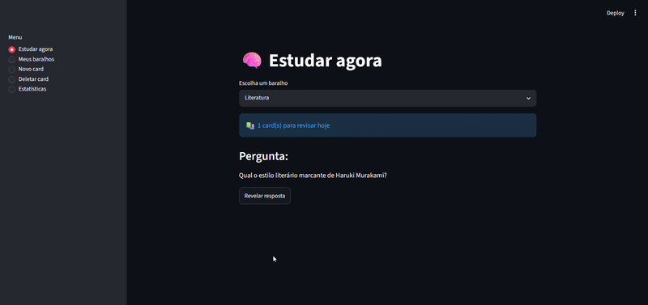
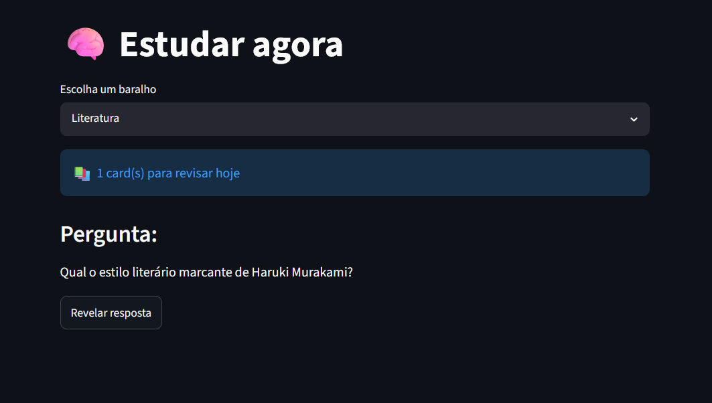
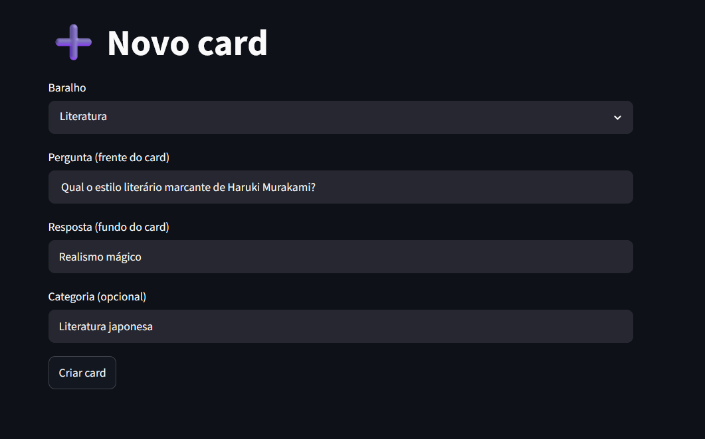
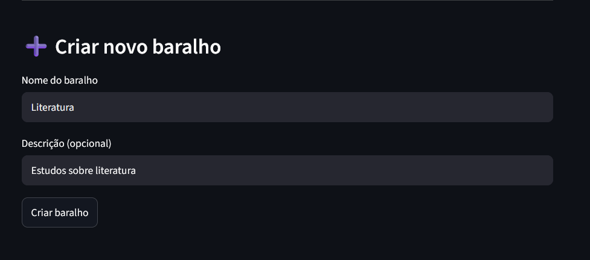

# 🧠 Neureka — Flashcards com Revisão Espaçada

> Aprenda mais, esqueça menos. O Neureka usa o algoritmo SM-2 de revisão espaçada para te mostrar cada card no momento certo — nem cedo demais, nem tarde demais.



---

## O que é isso?

O Neureka é uma aplicação completa de flashcards que funciona de forma inteligente. Em vez de te mostrar os cards aleatoriamente, ele calcula o intervalo ideal entre cada revisão baseado em quanto você está dominando o conteúdo.

Acerta fácil? O card some por mais tempo. Errou? Ele volta amanhã. Com o tempo, você estuda cada vez menos porque o sistema só te mostra o que você realmente precisa revisar.

---

## Como fica na prática

**Tela de estudo**



**Criando um novo card**



**Gerenciando baralhos**



---

## O algoritmo por trás

O Neureka usa uma versão simplificada do **SM-2** (SuperMemo 2), o mesmo algoritmo base do Anki.

Depois de ver um card, você dá uma nota de 1 a 5:

| Nota | Significado | Próxima revisão |
|------|-------------|-----------------|
| 1 | Errei completamente | amanhã |
| 2 | Errei mas lembrei algo | em 2 dias |
| 3 | Acertei, mas foi difícil | em 3 dias |
| 4 | Acertei com esforço | em 4 dias |
| 5 | Fácil demais | em 5 dias |

Além do intervalo, cada card tem um `ease_factor` que vai subindo conforme você acerta e caindo quando você erra — fazendo o sistema se adaptar ao seu ritmo de aprendizado.

---

## Tecnologias

**Backend**
- [FastAPI](https://fastapi.tiangolo.com/) — framework web para construção da API REST
- [SQLAlchemy](https://www.sqlalchemy.org/) — ORM para comunicação com o banco de dados
- [SQLite](https://www.sqlite.org/) — banco de dados local
- [Pydantic](https://docs.pydantic.dev/) — validação de dados e schemas

**Frontend**
- [Streamlit](https://streamlit.io/) — interface web construída inteiramente em Python

---

## Por que o Streamlit?

O frontend foi feito com Streamlit por um motivo simples: ele permite criar interfaces web funcionais usando só Python, sem precisar de HTML, CSS ou JavaScript.

Isso tem um custo: o Streamlit recarrega a página inteira a cada interação do usuário, o que causa uma leve lentidão. É uma limitação conhecida da biblioteca, e não um problema da API — se você testar os endpoints direto pelo Swagger em `/docs`, vai ver que as respostas são instantâneas.

Para uma versão futura, o plano é substituir o Streamlit por um frontend em React consumindo a mesma API.

---

## Como rodar localmente

Você vai precisar de dois terminais abertos ao mesmo tempo — um para a API e outro para o frontend.

### 1. Clone o repositório

```bash
git clone https://github.com/filipenascc/neureka.git
cd neureka
```

### 2. Crie o ambiente virtual e instale as dependências

```bash
python -m venv venv
venv\Scripts\activate  # Windows
# source venv/bin/activate  # Mac/Linux

pip install -r projeto/requirements.txt
pip install streamlit requests
```

### 3. Configure o banco de dados

Crie um arquivo `.env` dentro da pasta `projeto/` com o seguinte conteúdo:

```
DATABASE_URL=sqlite:///banco.db
```

### 4. Suba a API

```bash
cd projeto
uvicorn main:app --reload
```

A API estará disponível em `http://localhost:8000`
Documentação automática em `http://localhost:8000/docs`

### 5. Suba o frontend (em outro terminal)

```bash
cd neureka  # volta pra raiz do projeto
streamlit run app.py
```

O app estará disponível em `http://localhost:8501`

---

## Estrutura do projeto

```
neureka/
├── app.py                  # Frontend Streamlit
├── projeto/
│   ├── main.py             # Entrada da API FastAPI
│   ├── database.py         # Configuração do banco de dados
│   ├── spaced_repetition.py # Algoritmo SM-2
│   ├── models/
│   │   ├── deck.py         # Modelo de baralho
│   │   ├── card.py         # Modelo de card
│   │   └── review.py       # Modelo de revisão
│   ├── routes/
│   │   ├── deck_routes.py  # Rotas de baralhos
│   │   ├── card_routes.py  # Rotas de cards
│   │   └── session_routes.py # Rotas de sessão de estudo
│   └── schemas.py          # Schemas Pydantic
```

---

## Feito por

**Filipe Nascimento**

[](https://www.linkedin.com/in/filipenascc/)
